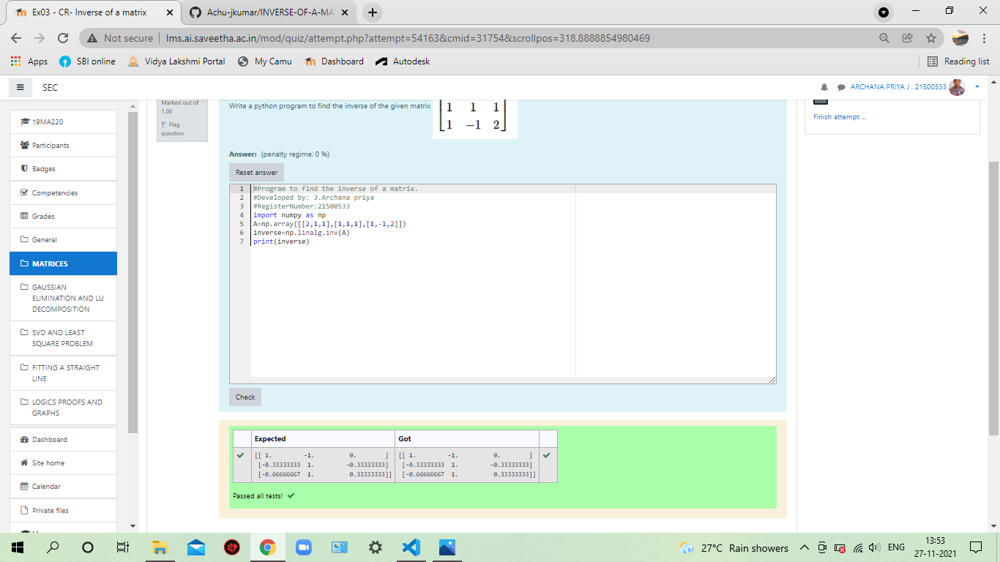

# INVERSE-OF-A-MATRIX
## Aim:
To write a python program to find the inverse of a matrix
## Equipment’s required:
1. 	Hardware – PCs
2. 	Anaconda – Python 3.7 Installation / Moodle-Code Runner
## Algorithm:
### Step1 : 
Import numpy
### Step 2:
 Assign the arrays.
### Step 3: 
Do the solving using linalg
### Step 4: 
Print the output.

## Program:
```
#Program to find the inverse of a matrix.
#Developed by: J.Archana priya
#RegisterNumber:21500533
import numpy as np
A=np.array([[2,1,1],[1,1,1],[1,-1,2]])
inverse=np.linalg.inv(A)
print(inverse)
```
## Output:


## Result:
Thus the inverse of given matrix is successfully solved using python program

